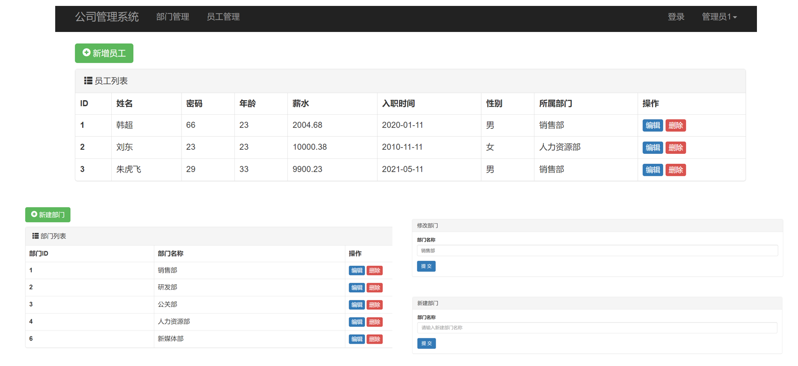

该demo建立了一套部门及员工管理系统，针对员工这张表的设计较为完善，在设计数据库时较好地回顾了课内理论知识，包括外键约束、级联删除等。本demo使用bootstrap建立起来简洁美观的UI，完成度已较高



```
以下是员工表的表结构
+-------------+---------------+------+-----+---------+----------------+
| Field       | Type          | Null | Key | Default | Extra          |
+-------------+---------------+------+-----+---------+----------------+
| id          | bigint        | NO   | PRI | NULL    | auto_increment |
| name        | varchar(32)   | NO   |     | NULL    |                |
| pwd         | varchar(64)   | NO   |     | NULL    |                |
| age         | int           | NO   |     | NULL    |                |
| salary      | decimal(10,2) | NO   |     | NULL    |                |
| create_time | datetime(6)   | NO   |     | NULL    |                |
| gender      | smallint      | NO   |     | NULL    |                |
| depart_id   | bigint        | NO   | MUL | NULL    |                |
+-------------+---------------+------+-----+---------+----------------+

```


开发中较为重要的知识点

1. Django提供的前端模板

   ```html
   layout.html
   ...
   <nav class="navbar navbar-inverse"...>
   ...
   </nav>
   
   
   
   <script src=""></script>
   <script src=""></script>
   ...
   
   others
   
   
   
   	<div class="container"...>
          ... 
   	</div>
   
   
   还可以在css,js处使用
   ```

2. ModelForm 以及 Form 简洁高效提供表单

   ```python
   class EmployeeModelForm(forms.ModelForm):
       name = forms.CharField(min_length=3, label="姓名")
   
       class Meta:
           model = models.EmployeeInfo
           # 下面列表中的元素来自数据库类的定义，省去了widgets中的麻烦，如果需要特殊定义可以参考最开始的name，重写一遍
           fields = ["name", "pwd", "age", 'salary', 'create_time', "gender", "depart"]
           # widgets = {
           #     "name": forms.TextInput(attrs={"class": "form-control"}),
           #     "password": forms.PasswordInput(attrs={"class": "form-control"}),
           #     "age": forms.TextInput(attrs={"class": "form-control"}),
           # }
   
       def __init__(self, *args, **kwargs):
           super().__init__(*args, **kwargs)
           # 循环找到所有的插件，添加了class="form-control"
           for name, field in self.fields.items():
               # 在这里可以追加样式，Django提供的ModelForm对于前后端分离不友好
               field.widget.attrs = {"class": "form-control", "placeholder": field.label}
   ```

3. 一个bug：先引Jquery 再引bootstrap中的js，陈旧的知识点
4. BTW ，还从存储部门id还是部门名称的问题中引出了实验课的思考题，即阿里的开发规范中为什么禁用外键，这里的答案从性能出发，空间换时间。因为访问次数过多，所以允许数据冗余，不连表，节约时间。


   

   


