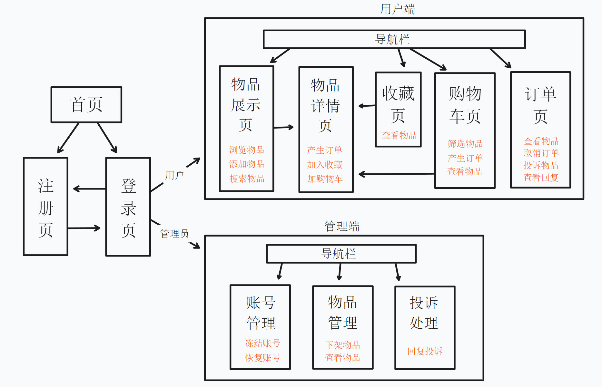
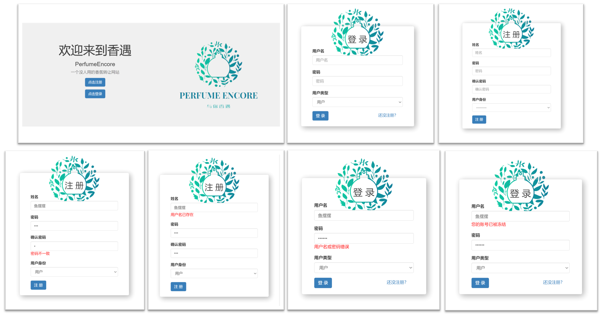
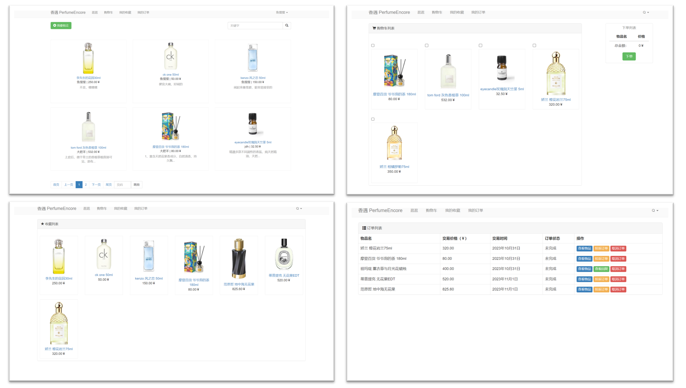
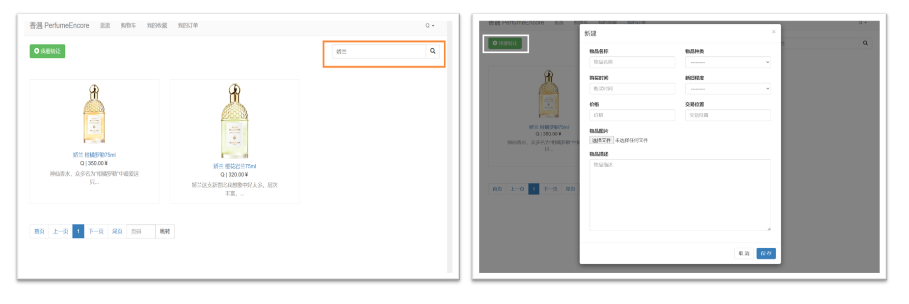
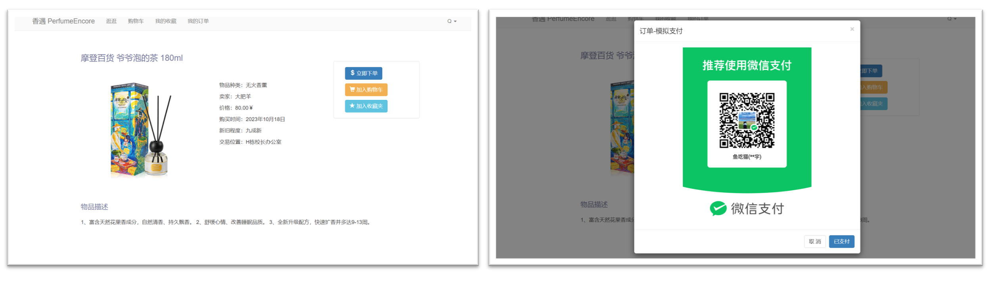
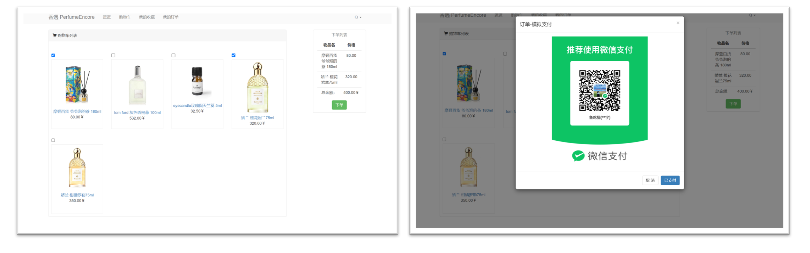
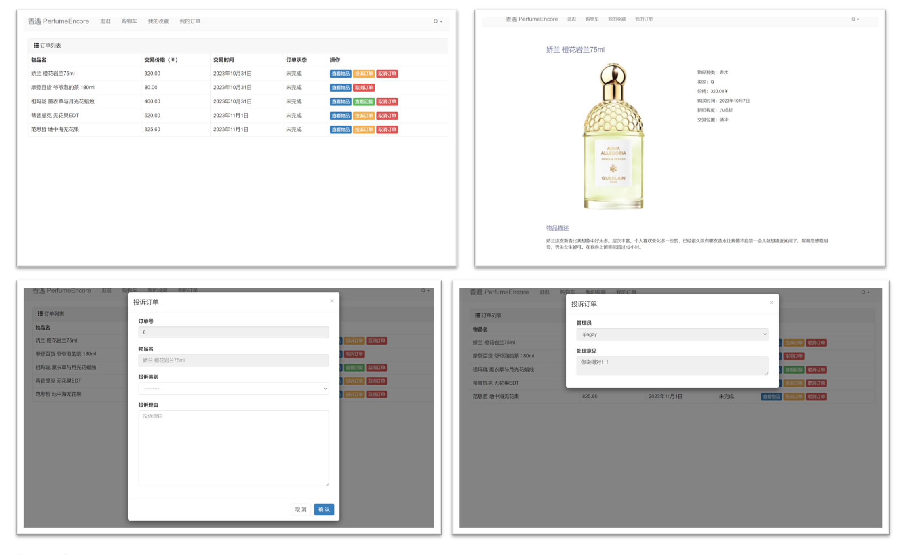
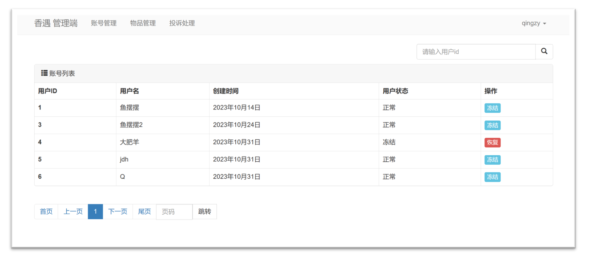
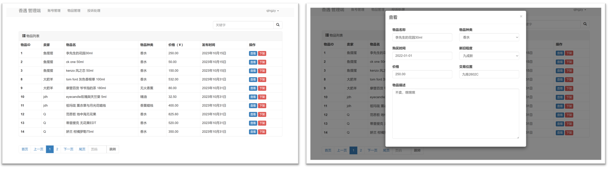
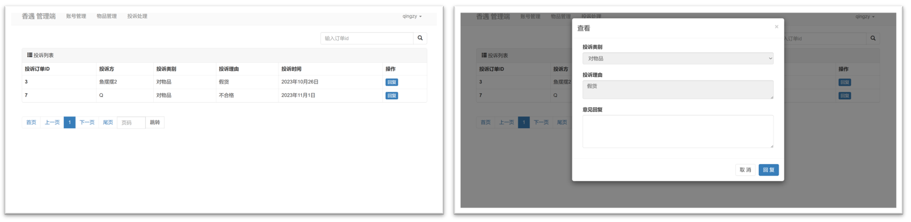

<div align="center">
<p style="font-size: 22px; font-weight:800;">PerfumeEncore<p/> 
<p style="font-size: 18px; font-weight:600;">一个没人用的香氛转让网站</p>

<div/>


---
<div >
<p align="center">
    <a href="https://docs.djangoproject.com/zh-hans/4.2/"></a>
    <a href="https://v3.bootcss.com/components/"></a>
    <a href="https://blog.jquery.com/2021/03/02/jquery-3-6-0-released/"></a>
    <a href="https://github.com/maochiyu1111/Webdev-Django/blob/PerfumeEncore/LICENSE"></a> 
</p>
<div/>


# Perfume Encore

HITSZ 数据库课程实验项目，要求为校园二手物品转让平台，因个人喜好略作修改。

[手把手教程参考](https://www.bilibili.com/video/BV1rT4y1v7uQ/?spm_id_from=333.337.search-card.all.click)，建议在时间充沛的情况下采用Django完成该实验，时间紧急的情况下极易因对框架不熟而debug无能，相关高质量博客内容较少。

主要技术：

- Python 3.10
- Django 4.2.6
- MySQL 8.0.30
- HTML 5
- BootStrap 3.4.1
- Jquery 3.6.0

主要开发环境：

- pycharm-professional-2023.2.1
- Google Chrome


## 系统功能:key:

<div align="center">

<div/>


## Django简述:star:

Django是一个流行的Python Web框架，在项目中Django可以简化对数据库的操作和队前端的渲染。建议先看教程学习Django架构。

- 对数据库：

  你无需编写SQL文件便可对表及表项进行增删改查。

  - 对于表的定义：

    表结构的定义通过 `models.py` 文件中类的定义进行创建或修改。在`settings.py` 配置好数据库后，编写

    ```python
    class UserInfo(models.Model):
        """ 用户表"""
        username = models.CharField(verbose_name="姓名", max_length=16)
        password = models.CharField(verbose_name="密码", max_length=64)
        create_time = models.DateField(verbose_name="创建时间", auto_now_add=True)
    
        usertype_choices = (
            (1, "用户"),
            (2, "管理员"),
        )
        usertype = models.SmallIntegerField(verbose_name="用户身份", choices=usertype_choices)
    
        status_choices = (
            (1, "注销"),
            (2, "正常"),
            (3, "冻结"),
        )
        statustype = models.SmallIntegerField(verbose_name="用户状态", choices=status_choices, default=2)
    ```

    然后执行 `python manage.py makemigrations` 以及 `python manage.py migrate` 两行指令，完成数据库迁移，即可在数据库中查看到：

    ```
    mysql> desc secondhand_userinfo;
    +-------------+-------------+------+-----+---------+----------------+
    | Field       | Type        | Null | Key | Default | Extra          |
    +-------------+-------------+------+-----+---------+----------------+
    | id          | bigint      | NO   | PRI | NULL    | auto_increment |
    | username    | varchar(16) | NO   |     | NULL    |                |
    | password    | varchar(64) | NO   |     | NULL    |                |
    | create_time | date        | NO   |     | NULL    |                |
    | usertype    | smallint    | NO   |     | NULL    |                |
    | statustype  | smallint    | NO   |     | NULL    |                |
    +-------------+-------------+------+-----+---------+----------------+
    ```

    注意：需安装 `pip install mysqlclient` 以支持数据库操作

  - 对于表项的增删改查:

    可以通过Django框架快速操作数据库表项，以下是一些例子

    ```python
    # 查找指定username的表项，返回第一个满足要求的对象
    user_object = models.UserInfo.objects.filter(username=form.instance.username).first()
    
    # 新增表项
    models.HandlingOpinionInfo.objects.create(manager_id=manager_id, order_id=order_id, opinion=reply)
    
    # 获取到指定对象后调用删除方法即可
    models.ShoppingCartInfo.objects.filter(item_id=item_id, user_id=user_id).first().delete()
    
    # 修改user表中的statustype一项，变成冻结
    user_obj = models.UserInfo.objects.filter(id=user_id).first()
    user_obj.statustype = 3
    user_obj.save()
    ```

    

- 对于前端渲染：

  - `urls.py` 文件的作用

    ```py
    path('login/', account.login),
    path('logout/', account.logout),
    ```

    上面第一句申明表示，当浏览器访问 '主域名/login/' 后，则会调用`account.py` 中的 `login` 函数

    ```python
    def login(request):
        """ 登录 """
        if request.method == "GET":
            form = LoginForm()
            return render(request, 'login.html', {'form': form})
        ...
    ```

    在这里，`login` 函数返回了一个模板页面 `login.html` 和一个字典，其中`form`是Django中一个强大的类，在这里，你可以认为这个对象与数据库有关，代表了从数据库获取信息（实际上没有查询获取数据库中的具体表项）

    而 `login.html` 如下运用传入的 `form`

    ```html
    <div class="form-group">
        <label>用户名</label>
        {{ form.username }}
        <span style="color: red;">{{ form.username.errors.0 }}</span>
    </div>
    ```

    可见，通过如下流程简介地完成了数据从数据库到前端的传递，实际上，Django会根据form对`login.html` 进行渲染，替换上面的`{{ form.username }}` 等字段，渲染完成后再传递给请求方。

    同时，很重要的一点是，该函数的返回值可以是一个render，也可以是`return redirect("/admin/item/manage/")` 、 `return JsonResponse({"status": False, 'error': form.errors})` 。也就是说，并不是一个域名对应一个页面。这为功能的实现提供了极大的灵活和便利，你可以结合`ajax`实现异步操作


## 效果展示:ghost:

### 用户端

1. 首页、登录、注册示意图。注册检测密码一致性、用户名是否存在。登录检测信息正确性、是否被冻结

<div align="center" >

<div/>


2. 用户登录后跳转到物品展示页面，即导航栏的“逛逛”，导航栏的“购物车”、“我的收藏”、“我的订单”页面如下

<div align="center" >

<div/>


3. 物品展示页面中，用户点击“我要转让”可以添加需要转让出的物品，使用右侧搜索栏可检索相关物品

<div align="center" >

<div/>


4. 在物品展示页面、收藏夹、购物车中点击物品图片或名称皆可跳转到物品详情页面，物品详情页面中可对该物品进行下单、收藏、加入购物车等操作。右图为下单页面，点击已支付后会产生订单

<div align="center" >

<div/>


5. 物品收藏页面无其余操作，再次点击加入收藏可取消对该物品的收藏。购物车页面可勾选一定数量物品，右侧栏会显示总金额。点击已支付会对勾选的所有物品产生订单。

<div align="center" >

<div/>


6. 订单页面中，每个订单都可以将取消或查看物品的操作。根据不同订单投诉情况的不同状态，如果没有进行投诉，即可进行投诉操作，若得到管理员回复则可查看回复

<div align="center" >

<div/>


### 管理端 

1. 对账号进行管理，可以冻结账号。若账号被冻结则可以恢复该账号

<div align="center" >

<div/>


2. 对物品进行管理，可以查看该物品信息。若物品违规，可下架该物品

<div align="center" >

<div/>


3. 对投诉进行处理，可以回复投诉。只显示未被回复的投诉

<div align="center" >

<div/>


本README[书写参考](https://github.com/hewei2001/campus-canteen-ordering/blob/main/README.md)
